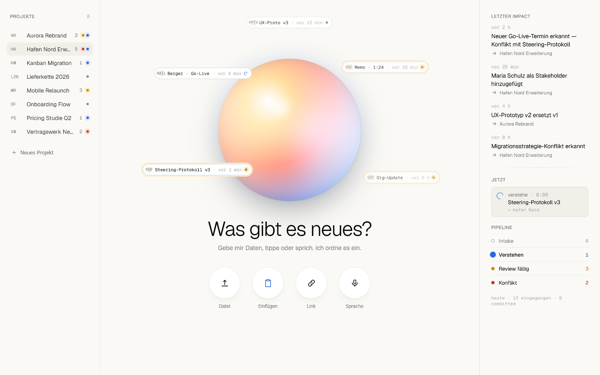
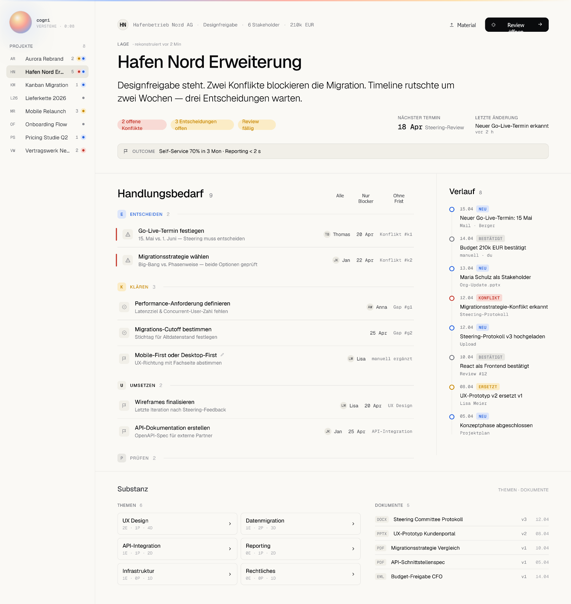
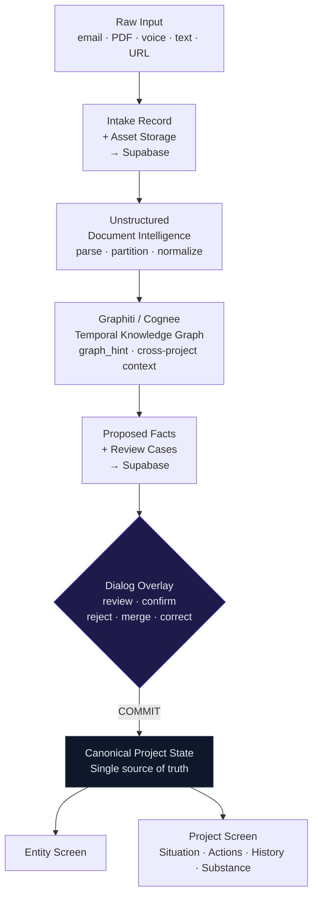
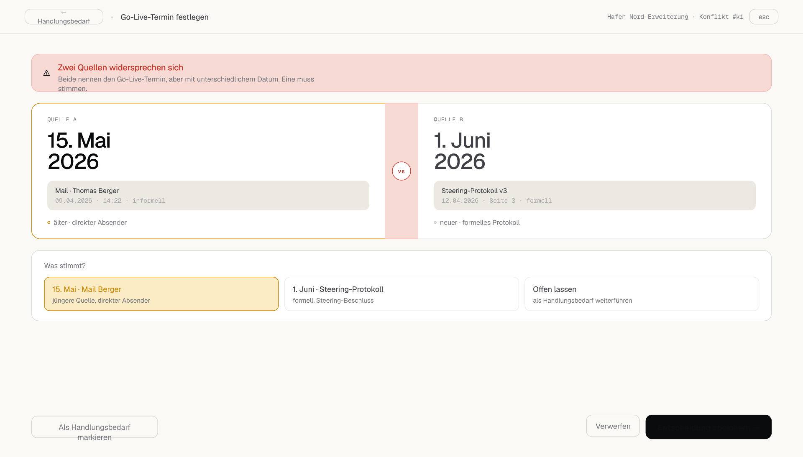

<div align="center">

<br />

# ◈ COGNI

### Your projects don't have a source of truth.&ensp;They have a pile.

<br />

[](./LICENSE)
[](https://www.typescriptlang.org/)
[](https://supabase.com)
[]()

<br />



<br />

</div>

---

> _Raw material flows in every day — emails, PDFs, meeting notes, forwarded decks, voice memos._  
> _Your current tools file it. Maybe tag it. Nobody ever synthesizes it._  
> _Projects don't fail from lack of information._  
> _They fail because nobody knows what's **actually true right now**._

**Cogni** is an agentic project intelligence — a central entity that reads raw project material from any source, extracts facts, detects contradictions and gaps, and builds a reliable project state.

Nothing becomes truth until you've reviewed and committed it.  
**No auto-commit. No hallucinated confidence. No false completeness.**

---

## The Entity

<div align="center">


</div>

At the center of Cogni lives **the Entity** — not a chatbot, not a dashboard, not another input form.

A presence that listens, processes, surfaces what changed, and then waits for your judgment.

Drop a PDF. Paste an email thread. Record a 30-second voice update. The Entity handles all of it through a single intake surface — recognizes the type, extracts meaning, cross-references what it already knows across all your projects, and constructs a review session for you.

Then it asks.

<details>
<summary><strong>▶ For nerds: Inside the intake pipeline</strong></summary>

<br />

Every input type — `.eml`, PDF, DOCX, PPTX, pasted text, voice memo, URL — enters the same pipeline with identical provenance standards. No special path for "quick notes."

```typescript
type IntakeRecord = {
  id: string;
  type: "file" | "text" | "voice" | "url" | "paste";
  source: AssetRef;
  receivedAt: ISODateString;
  processingState: "pending" | "extracted" | "proposed" | "committed" | "rejected";
};

type ProposedFact = {
  intakeId: string;
  content: FactContent;
  delta: "confirms" | "expands" | "replaces" | "contradicts" | "unclear";
  confidence: number;
  provenance: {
    source: AssetRef;
    extractedAt: ISODateString;
    extractionRun: string;
    graphHint?: GraphitiContext; // cross-project knowledge injected at intake time
  };
  gapSignals: GapSignal[];
  dependencySignals: DependencySignal[];
};
```

No proposed fact ever directly mutates project state.  
Every fact waits for a **Review Commit**.

</details>

---

## Three Screens. One Flow.

Cogni has exactly three surfaces:

**`Entity Screen`** — The global entry point. Everything comes in here.  
**`Project Screen`** — Four fixed roles. A synthesized project state, not a raw file list.  
**`Dialog Overlay`** — The review room. Where proposed facts become truth.

<br />

<div align="center">



</div>

<br />

<div align="center">

| Role                | What it shows                                                            |
| :------------------ | :----------------------------------------------------------------------- |
| **Situation**       | Reconstructed state · active conflicts · next hard deadline · last delta |
| **Action Required** | Open points · decisions pending · blockers · gaps with consequences      |
| **History**         | Timeline of changes · confirmed decisions · commits · milestones         |
| **Substance**       | Topics · documents with versions · source references                     |

</div>

<details>
<summary><strong>▶ For nerds: The canonical data flow</strong></summary>

<br />



**Hard coupling rule:** The graph layer is never the master. Supabase holds the truth.  
The UI never reads from raw tool output — only from committed project state.

```
App  →  Supabase as truth
     →  Unstructured as document service
     →  Graphiti/Cognee as knowledge engine
     →  back to Supabase
     →  App
```

</details>

---

## Why "No Auto-Commit"?

Because project intelligence that auto-commits isn't intelligence — it's noise with confidence.

<div align="center">



</div>

<br />

Cogni models **uncertainty as a first-class state**. Every extracted fact carries a delta:

| Delta         | Meaning                                             |
| :------------ | :-------------------------------------------------- |
| `confirms`    | Consistent with existing knowledge                  |
| `expands`     | New information, no contradiction                   |
| `replaces`    | Supersedes an older fact                            |
| `contradicts` | Collision with existing knowledge → **ConflictBox** |
| `unclear`     | System is uncertain → **GapBox** or deferred        |

Conflicts are not edge cases. Gaps are not UI badges.  
They are **core functional states** — the reason this thing exists.

<details>
<summary><strong>▶ For nerds: Gap & Conflict modeling</strong></summary>

<br />

```typescript
// Gaps are first-class objects with operational consequences
type GapSignal = {
  id: string;
  description: string;
  affectedFacts: string[];
  severity: "blocking" | "significant" | "minor";
  triggerBackQuestion: boolean; // true only when the gap has operational consequences
  // the Entity never asks noise questions
};

// Contradictions surface in the Dialog Overlay — never silently resolved
type Contradiction = {
  existingFact: FactRef;
  incomingFact: ProposedFact;
  conflictType: "version_clash" | "value_conflict" | "ownership_conflict" | "temporal_overlap";
  resolutionOptions: ("accept_new" | "keep_existing" | "merge" | "defer")[];
};
```

The system models **reconstructed reality** — not absolute truth.  
`Situation` on the Project Screen is an inference, not a ground truth.  
The UI never suggests more certainty than the underlying data supports.

</details>

---

## Tech Stack

| Layer                     | Technology                     | Responsibility                               |
| :------------------------ | :----------------------------- | :------------------------------------------- |
| **UI / Experience**       | React · TypeScript · Tailwind  | Product shell — renders committed state only |
| **Canonical State**       | Supabase · Postgres · Realtime | Single source of truth                       |
| **Document Intelligence** | Unstructured                   | Parse · partition · normalize                |
| **Knowledge Graph**       | Graphiti _or_ Cognee           | Context · relations · temporal retrieval     |
| **Entity**                | Custom orb · Framer Motion     | The face of the product                      |

<details>
<summary><strong>▶ For nerds: Why not one unified AI platform?</strong></summary>

<br />

Each layer has a hard responsibility boundary — by design:

- **Supabase** = canonical truth. Never graph logic.
- **Unstructured** = document structure. Never project meaning.
- **Graphiti/Cognee** = context and retrieval. Never canonical state.
- **UI** = committed project state. Never raw tool output.

A unified AI platform that owns everything would require trusting it with project truth — which breaks the core model. _Review before commit_ is only meaningful if these boundaries hold.

**The open decision:** Graphiti (stricter temporal graph, explicit fact invalidation, contradiction modeling) vs. Cognee (tighter pipeline integration, graph + vector + relational in one). Being evaluated on real data.

</details>

---

## Status

> ⚠️ **Early development.** Architecture locked. V1 pipeline in progress.

```
[ intake → extraction → review → commit → project state ]
  ████████░░░░░░░░░░░░░░░░   Entity core + pipeline: Phase 1 / 9
```

Current focus → [`docs/NOW.md`](./docs/NOW.md)  
Full architecture → [`docs/ARCHITECTURE.md`](./docs/ARCHITECTURE.md)  
Product spec → [`docs/PRODUCT.md`](./docs/PRODUCT.md)

---

## Contributing

The source is visible. Contributions — bug reports, proposals, pull requests — are welcome.

**Before contributing:** All contributions require acceptance of the [Contributor License Agreement](./LICENSE#contributor-license-agreement-cla) embedded in the license file. By submitting a PR, you confirm your agreement.

Start here for technical context: **[`AGENTS.md`](./AGENTS.md)**

---

## In One Sentence

_Outside: radically reduced. Inside: highly structured._

---

## License

[Proprietary — Source Visible](./LICENSE)

The source is public for transparency and collaboration.  
No usage rights are granted. Forking requires explicit written permission.  
Contributions transfer copyright to the project owner via CLA.

---

<div align="center">
<sub>Built in the open. Structured with conviction.</sub>
</div>
