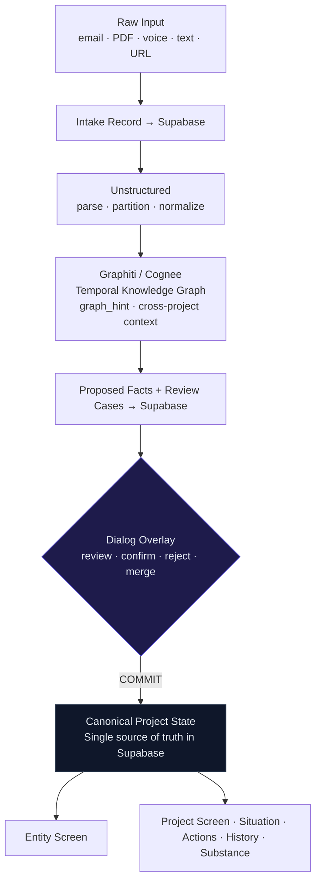

<div align="center">

<br />

# ◈ &nbsp; C O G N I

<br />

[](./LICENSE)
[](https://www.typescriptlang.org/)
[](https://supabase.com)
[]()

<br />

**Your projects don't have a source of truth.**
**They have a pile.**

<br />

</div>


<br />

---

<div align="center">

_AI wrote your code. Designed your UI. Answered your questions._
_Now it builds your project truth._

</div>

<br />

```
  2020 ── AI writes your code
  2022 ── AI designs your interfaces
  2024 ── AI answers your questions
  2026 ── AI builds your project truth    ◂ we are here
```

<br />

The last knowledge-work frontier isn't generation. It's **understanding** —
tracking what actually changed, what's in conflict, what's missing,
and what's true _right now_, across all your active projects.

---

## Not another PM tool

|               | The old model      | ◈ Cogni                                      |
| :------------ | :----------------- | :------------------------------------------- |
| **Input**     | Upload & forget    | Everything read, extracted, cross-referenced |
| **Conflicts** | Silently ignored   | Surfaced as first-class `ConflictBox`        |
| **Gaps**      | Unknown unknowns   | Named, classified, flagged with severity     |
| **Truth**     | Dashboard guessing | Review → Commit → Canonical state            |
| **AI role**   | Summaries & chat   | Structured project intelligence              |
| **Control**   | Auto-everything    | Nothing canonical without your review        |

---

## The Entity

<div align="center">


</div>

<br />

<div align="center">

**Not a chatbot. Not a dashboard. Not a form.**
**A presence that reads, understands, and waits.**

</div>

<br />

<table>
<tr>
<td width="50%" valign="top">

**It accepts everything**

```
 PDF  · DOCX · PPTX
 .eml · paste · URL
 voice memo · free text
 short status updates
 replies to its questions
```

</td>
<td width="50%" valign="top">

**It understands across projects**

```
 → parse & partition
 → extract facts
 → cross-reference graph
 → detect conflict + gaps
 → build review session
 → wait for your commit
```

</td>
</tr>
</table>

<details>
<summary><strong>▶ For nerds: The intake pipeline</strong></summary>

<br />

Every input type — `.eml`, PDF, pasted text, voice memo — enters the same pipeline with identical provenance. No shortcuts for "quick notes."

```typescript
type ProposedFact = {
  intakeId: string;
  delta: "confirms" | "expands" | "replaces" | "contradicts" | "unclear";
  confidence: number;
  provenance: {
    source: AssetRef;
    extractedAt: ISODateString;
    graphHint?: GraphitiContext; // cross-project knowledge at intake time
  };
  gapSignals: GapSignal[];
  dependencySignals: DependencySignal[];
};
```

No proposed fact ever directly mutates project state. Every fact waits for a **Review Commit**.

</details>

---

## Three screens. One flow.

```
┌─────────────────────┐     ┌─────────────────────┐     ┌─────────────────────┐
│                     │     │                     │     │                     │
│   01  Entity        │ ──▶ │   02  Dialog        │ ──▶ │   03  Project       │
│       Screen        │     │       Overlay       │     │       Screen        │
│                     │     │                     │     │                     │
│  Universal intake   │     │  Review · Commit    │     │  Ground truth       │
│  Everything in.     │     │  Reject · Merge     │     │  Four fixed roles   │
│                     │     │  Correct · Defer    │     │                     │
└─────────────────────┘     └─────────────────────┘     └─────────────────────┘
```

<br />

<table>
<tr>
<td width="25%" valign="top" align="center">

**Situation**

Reconstructed state now.
Active conflicts.
Next hard deadline.
Last delta.

</td>
<td width="25%" valign="top" align="center">

**Action Required**

Open points.
Decisions pending.
Blockers.
Gaps that matter.

</td>
<td width="25%" valign="top" align="center">

**History**

What changed.
What was confirmed.
What was committed.
The full delta log.

</td>
<td width="25%" valign="top" align="center">

**Substance**

Topics.
Documents + versions.
Source references.
The depth layer.

</td>
</tr>
</table>


<details>
<summary><strong>▶ For nerds: The canonical data flow</strong></summary>

<br />



```
Coupling rule:  App → Supabase as truth
                   → Unstructured as document service
                   → Graphiti/Cognee as knowledge engine
                   → back to Supabase → App
```

The graph layer is never the master. The UI never reads from raw tool output.

</details>

---

## The Review Principle

<div align="center">

**Project intelligence that auto-commits**
**isn't intelligence — it's noise with confidence.**

</div>

<br />


<br />

Every extracted fact is tagged with a **delta** before it ever reaches your project state:

| Delta         | Signal                             | Surfaces as           |
| :------------ | :--------------------------------- | :-------------------- |
| `confirms`    | Consistent with existing knowledge | ✓ Proposed as-is      |
| `expands`     | New, no contradiction              | ✓ Proposed as-is      |
| `replaces`    | Supersedes an older fact           | ⚠ Delta annotation    |
| `contradicts` | Collision with existing knowledge  | 🔴 ConflictBox        |
| `unclear`     | System uncertain                   | 🟡 GapBox or deferred |

<br />

> Conflicts are not edge cases.
> Gaps are not decorative badges.
> They are **the core reason this product exists**.

<details>
<summary><strong>▶ For nerds: Gap & Conflict modeling</strong></summary>

<br />

```typescript
type GapSignal = {
  severity: "blocking" | "significant" | "minor";
  triggerBackQuestion: boolean; // only true when gap has operational consequences
  // no noise questions
};

type Contradiction = {
  conflictType: "version_clash" | "value_conflict" | "ownership_conflict" | "temporal_overlap";
  resolutionOptions: ("accept_new" | "keep_existing" | "merge" | "defer")[];
};
```

The system models **reconstructed reality**, not absolute truth. `Situation` is an inference. The UI never suggests more certainty than the data supports.

</details>

---

## Stack

| Layer                     | Technology                     | Why                                                  |
| :------------------------ | :----------------------------- | :--------------------------------------------------- |
| **UI / Experience**       | React · TypeScript · Tailwind  | Renders committed state only — never raw tool output |
| **Canonical State**       | Supabase · Postgres · Realtime | Single source of truth. Period.                      |
| **Document Intelligence** | Unstructured                   | Parse, partition, normalize — not interpret          |
| **Knowledge Graph**       | Graphiti _or_ Cognee           | Temporal context · relations · fact invalidation     |
| **The Entity**            | Custom orb · Framer Motion     | The face of everything                               |

<details>
<summary><strong>▶ For nerds: Hard boundary rules</strong></summary>

<br />

```
Supabase        = canonical truth.     Never graph logic.
Unstructured    = document structure.  Never project meaning.
Graphiti/Cognee = context/retrieval.   Never canonical state.
UI              = committed state.     Never raw tool output.
```

A unified platform that owns everything would require trusting it with project truth — which breaks the review model entirely.

**Open decision:** Graphiti (stricter temporal graph, explicit fact invalidation) vs. Cognee (tighter pipeline, graph + vector + relational in one). Being evaluated on real data.

</details>

---

## Status

```
V1 scope:  intake → extraction → review → commit → project state

           ████████░░░░░░░░░░░░░░░░   Entity core: Phase 1 of 9
```

| Doc                                              | What's in it                         |
| :----------------------------------------------- | :----------------------------------- |
| [`docs/NOW.md`](./docs/NOW.md)                   | Current focus + active decisions     |
| [`docs/ARCHITECTURE.md`](./docs/ARCHITECTURE.md) | Full system architecture             |
| [`docs/PRODUCT.md`](./docs/PRODUCT.md)           | Product spec + principles            |
| [`AGENTS.md`](./AGENTS.md)                       | Start here if you want to contribute |

---

## Contributing

Source visible. Contributions welcome — bugs, proposals, pull requests.  
All contributions require the embedded [CLA](./LICENSE).  
By submitting a PR, you confirm your agreement.

---

## License

[Proprietary — Source Visible](./LICENSE) &nbsp;·&nbsp; Source is public for transparency.  
No usage rights granted. No forking without permission. Contributions transfer copyright via CLA.

---

<div align="center">

_Outside: radically reduced. Inside: highly structured._

<br />
<sub>Built in the open. Structured with conviction.</sub>

</div>
